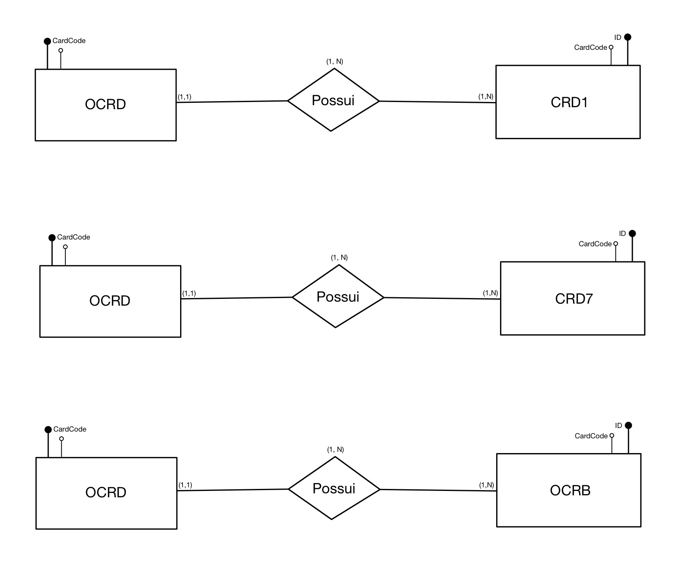
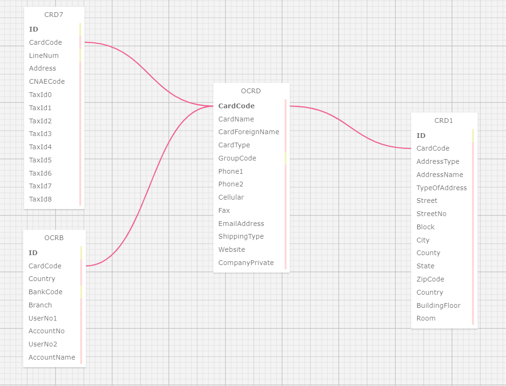

# Ponderada de modelos relacionais

## Enunciado

O objetivo desta atividade foi criar um modelo entidade-relacional que contemplasse:

- Modelo entidade-relacional: Representação das entidades, seus atributos e os relacionamentos entre elas.
- Tabelas: Estruturas das tabelas para visualização e manipulação de dados.
- SQL das tabelas: Script SQL para a criação das tabelas com suas respectivas chaves e relacionamentos.

Realizei a ponderada criando as relações apenas das tabelas de Cadastro PN e para as relações levei em consideração a criação dos campos ID's nas tabelas CRD1, CRD7 e OCRB.

### Modelos entidade relacional

O diagrama entidade-relacional a seguir ilustra como as entidades estão interligadas, definindo suas chaves primárias e relacionamentos entre as tabelas.

<div align="center">
<sub>Figura 1 - Modelos entidade relacional</sub>

<sup>Fonte: Autoria Própria</sup>
</div>

### Tabelas

A imagem a seguir ilustra as tabelas desenvolvidas no SQL toad mostrando a relação entre elas.

<div align="center">
<sub>Figura 2 - Tabelas</sub>

<sup>Fonte: Autoria Própria</sup>
</div>

### SQL das tabelas

O código SQL a seguir foi resultado da criação das tabelas e mostra a definição das chaves primárias e estrangeiras, assegurando que as relações entre as entidades fossem corretamente implementadas.

```sql
-- ---
-- Globals
-- ---

-- SET SQL_MODE="NO_AUTO_VALUE_ON_ZERO";
-- SET FOREIGN_KEY_CHECKS=0;

-- ---
-- Table 'OCRD'
-- 
-- ---

DROP TABLE IF EXISTS `OCRD`;
		
CREATE TABLE `OCRD` (
  `CardCode` VARCHAR(10) AUTO_INCREMENT,
  `CardName` VARCHAR,
  `CardForeignName` VARCHAR,
  `CardType` VARCHAR(50),
  `GroupCode` INTEGER,
  `Phone1` VARCHAR(15),
  `Phone2` VARCHAR(15),
  `Cellular` VARCHAR(15),
  `Fax` VARCHAR(15),
  `EmailAddress` VARCHAR(255),
  `ShippingType` VARCHAR,
  `Website` VARCHAR(255),
  `CompanyPrivate` VARCHAR(50),
  PRIMARY KEY (`CardCode`)
);

-- ---
-- Table 'CRD1'
-- 
-- ---

DROP TABLE IF EXISTS `CRD1`;
		
CREATE TABLE `CRD1` (
  `ID` INTEGER AUTO_INCREMENT,
  `CardCode` VARCHAR(10) AUTO_INCREMENT,
  `AddressType` VARCHAR(20),
  `AddressName` VARCHAR(50),
  `TypeOfAddress` VARCHAR(20),
  `Street` VARCHAR(100),
  `StreetNo` VARCHAR(10),
  `Block` VARCHAR(50),
  `City` VARCHAR(50),
  `County` VARCHAR(50),
  `State` CHAR(2),
  `ZipCode` VARCHAR(10),
  `Country` CHAR(2),
  `BuildingFloor` VARCHAR(10),
  `Room` VARCHAR(10),
  PRIMARY KEY (`ID`)
);

-- ---
-- Table 'CRD7'
-- 
-- ---

DROP TABLE IF EXISTS `CRD7`;
		
CREATE TABLE `CRD7` (
  `ID` INTEGER NULL AUTO_INCREMENT,
  `CardCode` VARCHAR(10),
  `LineNum` INTEGER,
  `Address` VARCHAR(50),
  `CNAECode` VARCHAR(20),
  `TaxId0` VARCHAR(20),
  `TaxId1` VARCHAR(20),
  `TaxId2` VARCHAR(20),
  `TaxId3` VARCHAR(20),
  `TaxId4` VARCHAR(20),
  `TaxId5` VARCHAR(20),
  `TaxId6` VARCHAR(20),
  `TaxId7` VARCHAR(20),
  `TaxId8` VARCHAR(20),
  PRIMARY KEY (`ID`)
);

-- ---
-- Table 'OCRB'
-- 
-- ---

DROP TABLE IF EXISTS `OCRB`;
		
CREATE TABLE `OCRB` (
  `ID` INTEGER AUTO_INCREMENT,
  `CardCode` VARCHAR(10),
  `Country` CHAR(2),
  `BankCode` INTEGER,
  `Branch` VARCHAR(10),
  `UserNo1` VARCHAR(20),
  `AccountNo` VARCHAR(20),
  `UserNo2` VARCHAR(20),
  `AccountName` VARCHAR(50),
  PRIMARY KEY (`ID`)
);

-- ---
-- Foreign Keys 
-- ---

ALTER TABLE `CRD1` ADD FOREIGN KEY (CardCode) REFERENCES `OCRD` (`CardCode`);
ALTER TABLE `CRD7` ADD FOREIGN KEY (CardCode) REFERENCES `OCRD` (`CardCode`);
ALTER TABLE `OCRB` ADD FOREIGN KEY (CardCode) REFERENCES `OCRD` (`CardCode`);

-- ---
-- Table Properties
-- ---

-- ALTER TABLE `OCRD` ENGINE=InnoDB DEFAULT CHARSET=utf8 COLLATE=utf8_bin;
-- ALTER TABLE `CRD1` ENGINE=InnoDB DEFAULT CHARSET=utf8 COLLATE=utf8_bin;
-- ALTER TABLE `CRD7` ENGINE=InnoDB DEFAULT CHARSET=utf8 COLLATE=utf8_bin;
-- ALTER TABLE `OCRB` ENGINE=InnoDB DEFAULT CHARSET=utf8 COLLATE=utf8_bin;

-- ---
-- Test Data
-- ---

-- INSERT INTO `OCRD` (`CardCode`,`CardName`,`CardForeignName`,`CardType`,`GroupCode`,`Phone1`,`Phone2`,`Cellular`,`Fax`,`EmailAddress`,`ShippingType`,`Website`,`CompanyPrivate`) VALUES
-- ('','','','','','','','','','','','','');
-- INSERT INTO `CRD1` (`ID`,`CardCode`,`AddressType`,`AddressName`,`TypeOfAddress`,`Street`,`StreetNo`,`Block`,`City`,`County`,`State`,`ZipCode`,`Country`,`BuildingFloor`,`Room`) VALUES
-- ('','','','','','','','','','','','','','','');
-- INSERT INTO `CRD7` (`ID`,`CardCode`,`LineNum`,`Address`,`CNAECode`,`TaxId0`,`TaxId1`,`TaxId2`,`TaxId3`,`TaxId4`,`TaxId5`,`TaxId6`,`TaxId7`,`TaxId8`) VALUES
-- ('','','','','','','','','','','','','','');
-- INSERT INTO `OCRB` (`ID`,`CardCode`,`Country`,`BankCode`,`Branch`,`UserNo1`,`AccountNo`,`UserNo2`,`AccountName`) VALUES
-- ('','','','','','','','','');